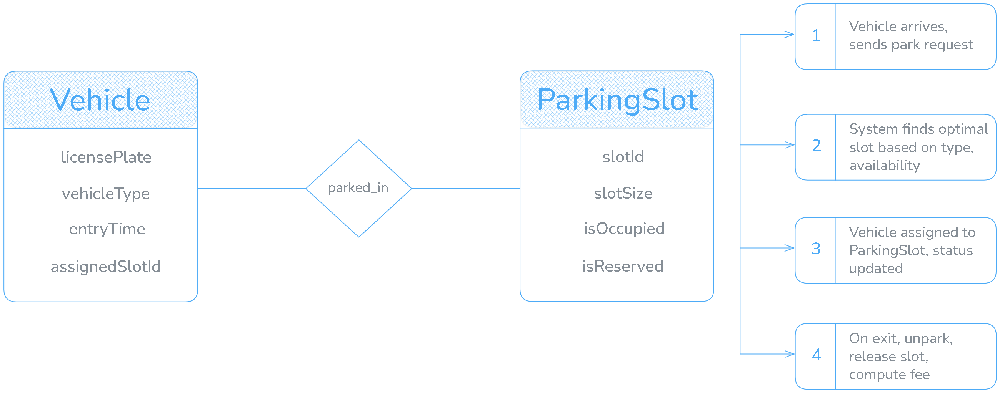

# Intelligent Parking System 🚗🅿️

A Spring Boot–based **Intelligent Parking System** that digitally manages parking slots and vehicles.  
It exposes REST APIs and includes a simple Tailwind CSS dashboard to visualize and control the parking lot in real time.

---

## 📘 Table of Contents

- [Overview](#overview)
- [Features](#features)
- [Architecture](#architecture)
- [ER Diagram & Workflow](#er-diagram--workflow)
- [Tech Stack](#tech-stack)
- [Getting Started](#getting-started)
  - [Prerequisites](#prerequisites)
  - [Clone the Repository](#clone-the-repository)
  - [Backend Setup](#backend-setup)
  - [Frontend / UI](#frontend--ui)
- [Running the Application](#running-the-application)
- [API Endpoints](#api-endpoints)
- [Project Structure](#project-structure)
- [How It Works](#how-it-works)
  - [Parking Workflow](#parking-workflow)
  - [Unparking Workflow](#unparking-workflow)
- [Testing](#testing)
- [Future Enhancements](#future-enhancements)
- [License](#license)
- [Author](#author)

---

## Overview

The **Intelligent Parking System (IPS)** is a web application that manages a parking lot digitally.  
It models each **parking slot** and **vehicle** as entities and automates:

- Slot initialization (normal, handicap, EV)
- Parking of incoming vehicles
- Unparking and releasing slots
- Displaying live slot status on a dashboard

The project is designed as a **learning-friendly** yet **industry-style** Spring Boot app that can later be connected to sensors, a mobile app, or payment gateways.

---

## Features

- **Digital Parking Lot Representation**
  - Each slot is stored in the database with type, occupancy, and reservation status.
- **Automatic Slot Allocation**
  - Picks the most suitable free slot based on vehicle type and slot category.
- **Park / Unpark Operations**
  - REST endpoints to park a vehicle and unpark it.
- **Real-Time Status Dashboard**
  - Tailwind CSS UI to visualize slots (free/occupied/reserved).
- **Extensible Architecture**
  - Service-oriented, ready for IoT, payment, and analytics integration.

---

## Architecture

High-level layers:

1. **Client Layer**
   - HTML + Tailwind CSS + Vanilla JS dashboard.
2. **REST API Layer**
   - `ParkingController` exposes endpoints for status, park, and unpark.
3. **Service Layer**
   - `ParkingManager` implements all parking logic and rules.
4. **Data Access Layer**
   - Spring Data JPA repositories (`ParkingSlotRepository`, `VehicleRepository`).
5. **Database Layer**
   - H2 (in-memory) or MySQL for persistent storage.

You can include a simple architecture diagram here:

```kotlin
                ┌───────────────────────┐
                │   Browser Dashboard   │
                │  (HTML + Tailwind +   │
                │     JavaScript)       │
                └──────────┬────────────┘
                           │  HTTP (REST)
                           │
                ┌──────────▼────────────┐
                │   Spring Boot App     │
                │  (Intelligent Parking │
                │        System)        │
                └──────────┬────────────┘
                           │
      ┌────────────────────┼─────────────────────┐
      │                    │                     │
┌─────▼─────┐       ┌──────▼────────┐      ┌─────▼─────┐
│ Controller│       │  Service      │      │  Repos /  │
│  Layer    │       │  Layer        │      │  DAO      │
│(REST APIs)│       │ ParkingManager│      │(JPA Repos)│
└─────┬─────┘       └──────┬────────┘      └─────┬─────┘
      │                    │                     │
      │ calls              │ business logic      │ CRUD
      │                    │                     │
      │              ┌─────▼─────┐               │
      │              │   Model   │               │
      │              │ Entities  │               │
      │              │(Vehicle,  │               │
      │              │ParkingSlot│               │
      │              └─────┬─────┘               │
      │                    │                     │
      └────────────────────┼─────────────────────┘
                           │
                     ┌─────▼──────┐
                     │  Database  │
                     │ (H2/MySQL) │
                     └────────────┘


Optional / Future Integrations (outside main box):

   ┌──────────────────┐        ┌───────────────────┐
   │   Mobile App     │        │  IoT Sensors      │
   │(User Booking UI) │        │(Slot Occupancy)   │
   └───────┬──────────┘        └─────────┬─────────┘
           │       REST APIs / MQTT      │
           └────────────┬────────────────┘
                        │
                        ▼
                 Spring Boot App
```

---

## ER Diagram & Workflow


**Fig.:** ER Diagram and Workflow of Intelligent Parking System

**Entities**

- Vehicle
  - `licensePlate` (PK)
  - `vehicleType`
  - `entryTime`
  - `assignedSlotId`

- ParkingSlot
  - `slotId` (PK)
  - `slotSize`
  - `isOccupied`
  - `isReserved`
  - `vehicle` (FK → `Vehicle.licensePlate`)

**Relationship**

- `Vehicle` parked_in `ParkingSlot`
  → One-to-One relationship (a slot holds at most one vehicle at a time).

The diagram also illustrates the workflow:

1. Vehicle arrives and sends a park request.
2. System finds optimal slot based on type and availability.
3. Vehicle is assigned to the slot and status is updated.
4. On exit, vehicle is unparked, slot is released, and (optionally) fee is computed.

---

## Tech Stack

- **Language:** Java
- **Backend Framework:** Spring Boot
- **Build Tool:** Maven
- **Persistence:** Spring Data JPA
- **Database:** H2 (default) or MySQL
- **Frontend:** HTML5, Tailwind CSS, Vanilla JavaScript
- **Other:** Lombok (optional), Jakarta Persistence annotations

---

## Getting Started

### Prerequisites
  - Java 17 or later
  - Maven 3.x
  - (Optional) Node.js if you want to build Tailwind via CLI
  - Git
  - A modern browser (Chrome / Edge / Firefox)

### Clone the Repository
```bash
git clone https://github.com/Souvikdas040/intelligent-parking-system.git
cd intelligent-parking-system
```

### Backend Setup
  1. Open the project in your IDE (IntelliJ / Eclipse / VS Code).
  2. Ensure Maven downloads all dependencies.
  3. Configure the database:

**Option 1 – H2 (In-Memory, default)**

**In ```src/main/resources/application.properties```:**
```properties
spring.datasource.url=jdbc:h2:mem:parkingdb
spring.datasource.driverClassName=org.h2.Driver
spring.datasource.username=sa
spring.datasource.password=
spring.jpa.hibernate.ddl-auto=update
spring.h2.console.enabled=true
```

**Option 2 – MySQL (Persistent)**
```properties
spring.datasource.url=jdbc:mysql://localhost:3306/parkingdb
spring.datasource.username=root
spring.datasource.password=your_password
spring.jpa.hibernate.ddl-auto=update
spring.jpa.show-sql=true
```

Create the database ```parkingdb``` manually in MySQL before running.

### Frontend / UI
- If Tailwind CSS files are already built, the HTML pages in ```src/main/resources/static/``` can be used directly.
- If you want to modify styles with Tailwind:

  1. Initialize a Tailwind project (optional – if not done already).
  2. Run the Tailwind build script to generate the final CSS.
  3. Ensure the generated CSS is referenced in your HTML (```static/css/tailwind.css``` or similar).

---

## Running the Application

From the project root:
```bash
mvn spring-boot:run
```

Or build a jar:
```bash
mvn clean package
java -jar target/intelligent-parking-system-*.jar
```

By default, the app will be available at:
```test
http://localhost:8080
```

- API base URL: ```http://localhost:8080/api/parking``` (example)
- UI dashboard: ```http://localhost:8080/``` (if mapped to static index.html)

---

## API Endpoints

### Get Parking Slot Status
```http
GET /api/parking/status
```

**Response (200 OK)**
```json
[
  {
    "slotId": "S1",
    "slotSize": "HANDICAP",
    "occupied": true,
    "reserved": true,
    "vehicleLicense": "KA01AB1234"
  },
  {
    "slotId": "S2",
    "slotSize": "EV",
    "occupied": false,
    "reserved": true,
    "vehicleLicense": null
  }
]
```

---

### Park a Vehicle
```http
POST /api/parking/park
Content-Type: application/json
```

**Request Body**
```json
{
  "licensePlate": "KA01AB1234",
  "vehicleType": "CAR"
}
```

**Example Success Response**
```json
{
  "message": "Vehicle KA01AB1234 parked in slot S7",
  "slotId": "S7"
}
```

---

### Unpark a Vehicle
```http
POST /api/parking/unpark
Content-Type: application/json
```

**Request Body**
```json
{
  "licensePlate": "KA01AB1234"
}
```
or
```json
{
  "slotId": "S7"
}
```
**Example Success Response**
```json
{
  "message": "Vehicle KA01AB1234 unparked from slot S7"
}
```

---

## Project Structure
Example structure (adjust based on your actual packages):

```text
intelligent-parking-system/
├─ src/
│  ├─ main/
│  │  ├─ java/
│  │  │  └─ com/example/parking/
│  │  │     ├─ IntelligentParkingSystemApplication.java
│  │  │     ├─ controller/
│  │  │     │  └─ ParkingController.java
│  │  │     ├─ service/
│  │  │     │  └─ ParkingManager.java
│  │  │     ├─ model/
│  │  │     │  ├─ ParkingSlot.java
│  │  │     │  └─ Vehicle.java
│  │  │     └─ repository/
│  │  │        ├─ ParkingSlotRepository.java
│  │  │        └─ VehicleRepository.java
│  │  ├─ resources/
│  │  │  ├─ static/
│  │  │  │  ├─ index.html
│  │  │  │  └─ css/ (Tailwind output)
│  │  │  └─ application.properties
│  └─ test/
│     └─ java/
│        └─ com/example/parking/
│           └─ IntelligentParkingSystemApplicationTests.java
└─ docs/
   └─ er-diagram-intelligent-parking-system.png
```

---

## How It Works

### Parking Workflow
1. User enters license plate and vehicle type in the UI.
2. Frontend sends a ```POST /api/parking/park``` request.
3. ```ParkingManager```:
   - Validates the input.
   - Searches for an available slot based on type and reservation rules.
   - Creates/updates a ```Vehicle``` entity with ```entryTime```.
   - Marks the chosen ```ParkingSlot``` as occupied and links it to the vehicle.
4. Response is sent back with details of the assigned slot.
5. UI displays a success message and updates the status grid.

### Unparking Workflow
1. User selects the slot or enters the license plate to unpark.
2. Frontend calls ```POST /api/parking/unpark```.
3. ```ParkingManager```:
   - Validates that the slot/vehicle exists and is occupied.
   - Retrieves the ```Vehicle``` and computes duration (for future fee logic).
   - Clears the ```ParkingSlot```’s vehicle reference and marks it free.
   - Deletes or archives the ```Vehicle``` record.
4. UI updates to show the slot as free.

---

## Testing
Run unit tests:
```bash
mvn test
```

Tests can verify:
- Context loading
- Slot initialization logic
- Slot allocation for different vehicle types
- Correct unpark behaviour and state updates

---

## Future Enhancements
- ⛓ IoT Integration: Connect physical sensors to update occupancy automatically.
- 📱 Mobile App: Let users check & reserve slots from anywhere.
- 💳 Payment Gateway: Calculate parking fees and complete transactions online.
- 📊 Analytics Dashboard: Charts for peak hours, occupancy rate, and revenue.
- 🏢 Multi-Lot / Multi-Level Support: Manage several parking locations centrally.

---

## License
This project is open-source.
You can use any license you prefer, e.g.:

```text
MIT License
Copyright (c) 2025 Souvik Das
```

---

## Author
**Souvik Das**
Full Stack Developer

Feel free to connect on LinkedIn or GitHub once you publish this project.

---
